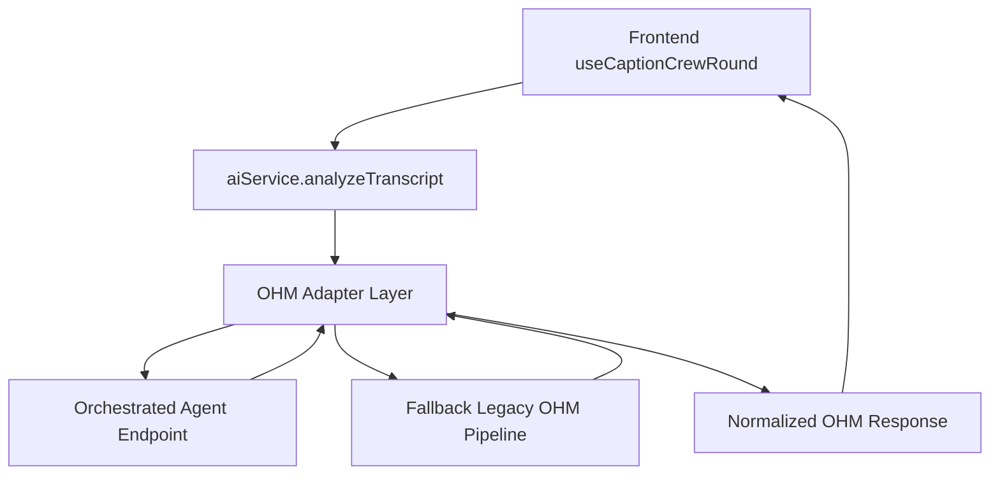

# OHM Integration Adapter Spec

**Spec ID:** `OHM-ADAPTER-SPEC-v1`
**Version:** `1.0.0-draft`
**Date (GMT+7):** 2026-04-23
**Owner:** THC Caption Crew Team
**Status:** Draft (No production rollout yet)

---

## 1) Objective

Integrate a **Google-built orchestrated Agent** (detect → retrieve memory → reason → score → self-check) into THC Caption Crew without breaking existing UI/API contract.

Adapter must preserve current output schema while adding optional diagnostics and memory metadata.

---

## 2) Non-negotiable business rules

1. Label constitution:
   - **GREEN** = discourse opener/transition starter
   - **BLUE** = reusable sentence frame
   - **RED** = idiom/proverb/figurative saying (**idiom/proverb must always be RED**)
   - **PINK** = difficult/key vocabulary/collocation (avoid trivial/common words)
2. Canonical weights: `GREEN=5`, `BLUE=7`, `RED=9`, `PINK=3`
3. Length coefficients allowed set: `1, 1.5, 2, 2.5` and `overLong=2.5`
4. Final scoring formula:

```text
baseOhm = sum(chunk.ohm)
totalOhm = baseOhm * lengthCoefficient * responseCoefficient
```

5. Response-time coefficient R:
   - `reactionDelayMs <= 2000` => `R = 1.0`
   - `reactionDelayMs >= 5000` => `R = 1/3`
   - between 2000..5000 => linear decay to 1/3

---

## 3) Integration topology

- Existing frontend calls current backend entrypoint (`analyzeTranscriptOhm` flow through `aiService`).
- **Adapter Layer** in backend decides:
  1. call orchestrated agent (new)
  2. validate/normalize output
  3. fallback to current deterministic path when needed
- Keep backward-compatible response for UI.



---

## 4) Adapter API contract

### 4.1 Inbound request (adapter internal)

```json
{
  "transcript": "string",
  "model": "gpt|gemini|auto",
  "fallbackModel": "string-optional",
  "reactionDelayMs": 0,
  "flags": {
    "useMemoryAssist": true,
    "returnDebug": true
  },
  "context": {
    "sessionId": "optional",
    "roundId": "optional",
    "userId": "optional"
  }
}
```

### 4.2 Expected agent response (from Google builder service)

```json
{
  "transcriptRaw": "...",
  "transcriptNormalized": "...",
  "chunks": [
    { "text": "...", "label": "GREEN", "confidence": 0.92, "reason": "..." }
  ],
  "modelUsed": "gemini-...",
  "diagnostics": {
    "rawChunkCount": 4,
    "dropReasons": [],
    "memoryHits": 3,
    "selfCheckPassed": true
  }
}
```

### 4.3 Final adapter output to existing app (must keep)

```json
{
  "transcriptRaw": "...",
  "transcriptNormalized": "...",
  "chunks": [
    { "text": "...", "label": "GREEN", "ohm": 5, "confidence": 0.92, "reason": "..." }
  ],
  "formula": "12 x 1.5 x 0.78",
  "totalOhm": 14.04,
  "modelUsed": "gemini-...",
  "baseOhm": 12,
  "lengthBucket": "short",
  "lengthCoefficient": 1.5,
  "responseCoefficient": 0.78,
  "sentenceCount": 2,
  "wordCount": 31,
  "elapsedMs": 1500,
  "filteredChunkCount": 1,
  "lexiconChunkCount": 0,
  "compositeChunkCount": 1,
  "debug": {
    "rawChunkCount": 4,
    "dropReasons": [
      { "text": "...", "reason": "NOT_OPENER_SCOPE" }
    ],
    "memoryHits": 3,
    "selfCheckPassed": true
  }
}
```

---

## 5) Adapter responsibilities

1. **Validate schema** from agent response.
2. **Normalize labels** to `GREEN|BLUE|RED|PINK`.
3. **Enforce hard constraints**:
   - idiom/proverb forced RED
   - exact-substring safety
   - reject noise/filler chunks
4. **Compute OHM** with canonical weights + length coefficient + response coefficient.
5. **Attach compatibility fields** expected by existing UI.
6. **Fallback** to existing pipeline on timeout/invalid response.

---

## 6) Runtime config additions

Add these to admin runtime config:

```json
{
  "ohmAgentEnabled": false,
  "ohmAgentEndpoint": "",
  "ohmAgentApiKey": "",
  "ohmAgentTimeoutMs": 9000,
  "ohmAgentShadowMode": true,
  "ohmResponseTiming": {
    "fullScoreMs": 2000,
    "minScoreMs": 5000,
    "minCoefficient": 0.333333
  }
}
```

Rules:
- `ohmAgentEnabled=false` by default.
- `shadowMode=true` means call agent but do not affect final score (for evaluation period).

---

## 7) Version control & release controls (mandatory)

### 7.1 Adapter semantic versioning
- `MAJOR`: breaking output or contract changes
- `MINOR`: backward-compatible new fields/logic
- `PATCH`: bugfix only

### 7.2 Release checklist
1. Commit with clear scope
2. Tag before deploy (e.g. `prod-YYYY-MM-DD-ohm-agent-vX-Y-Z`)
3. Push commit + tag
4. Deploy to staging/shadow first
5. Validate golden set + latency gates
6. **Ask for explicit human confirmation** before production publish

### 7.3 Rollback contract
- Keep previous adapter path + legacy path deployable.
- One-command rollback to prior tag for functions/hosting.

---

## 8) Test gates (required before prod)

1. **Contract tests**: response keys and types unchanged
2. **Label correctness tests**: curated set for GREEN/BLUE/RED/PINK
3. **Regression tests**:
   - idiom must be RED
   - clause-opener GREEN preserved
   - trivial PINK rejected
4. **Scoring tests**:
   - verify formula and rounded total
   - verify R curve at 2s / 3s / 4s / 5s
5. **Reliability tests**:
   - timeout fallback works
   - invalid agent JSON fallback works

---

## 9) Prompt pack to send to Google App Builder

### 9.1 Builder instruction prompt

```text
Build a Cloud Run orchestrated agent service called ohm-memory-agent.

Purpose:
- Evaluate Vietnamese transcript semantics for OHM scoring.
- Use a multi-step flow: detect -> retrieve memory -> reason/rerank -> score -> self-check.
- Optimize for semantic correctness and explainability.

Hard constraints:
- Labels: GREEN (opener), BLUE (sentence frame), RED (idiom/proverb/figurative), PINK (difficult vocab).
- Idiom/proverb must always be RED.
- Extract exact substrings only.
- Ignore fillers/trivial single words.
- Return JSON with transcriptRaw, transcriptNormalized, chunks, modelUsed, diagnostics.
- Include confidence 0..1 and reason per chunk.

Scoring policy used by caller:
- weights GREEN=5 BLUE=7 RED=9 PINK=3.
- caller computes total score with length coefficient and response coefficient.

Deliverables:
- Cloud Run service
- API schema
- Firestore memory schema
- test suite + rollout/rollback notes
```

### 9.2 Runtime evaluator system prompt

```text
You are the OHM semantic evaluator.
Your goal is to produce accurate, explainable semantic chunks.
Do not maximize chunk count; maximize correctness.

Constitution:
- GREEN: discourse opener/transition starter.
- BLUE: reusable sentence frame.
- RED: idiom/proverb/figurative saying; if idiom/proverb, always RED.
- PINK: difficult/key vocabulary or collocation; avoid trivial words.

Rules:
1) Extract exact substrings from transcript.
2) Reject filler/particle-only chunks.
3) Calibrate confidence in 0..1.
4) Use retrieved memory as prior, but transcript-context wins on conflict.
5) Return JSON only.
```

### 9.3 Self-check prompt

```text
Validate candidate chunks:
- substring exactness
- constitution compliance
- idiom/proverb RED enforcement
- remove duplicates/overlaps with weaker confidence
Return corrected chunks + drop reasons + selfCheckPassed.
```

---

## 10) Integration handoff package (what Google builder must return)

1. Endpoint URL + auth method
2. OpenAPI / JSON schema
3. Example request/response payloads
4. Firestore collection definitions + sample docs
5. Env var list
6. Latency + quality benchmark report (golden set)
7. Rollback instructions

---

## 11) Acceptance criteria for this spec

- Existing UI renders without code break
- All legacy OHM keys preserved
- Agent path can be toggled on/off by config
- Production release only after explicit user confirmation
- Version tags and rollback path documented
